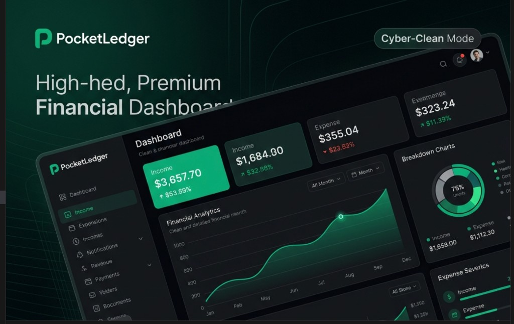

# PocketLedger

A full-stack personal finance dashboard for tracking income, expenses, categories, and financial trends in one place.



## Highlights

- Secure account creation and JWT-based authentication
- Income and expense tracking with custom categories
- Dashboard summaries and interactive charts
- Daily, weekly, and monthly financial reports
- Month-over-month and week-over-week insights
- Transaction export
- Preferred-currency settings
- Responsive interface for desktop and mobile

## Tech stack

- **Frontend:** Next.js 16, React 19, TypeScript, Tailwind CSS
- **Data visualization:** Recharts
- **Backend:** Next.js route handlers and service/controller architecture
- **Database:** Prisma with SQLite locally and PostgreSQL support
- **Validation and state:** Zod, Zustand
- **Authentication:** JWT stored in HTTP-only cookies

## Getting started

### 1. Clone the repository

```bash
git clone https://github.com/jidenyms/PocketLedger.git
cd PocketLedger
npm install
```

### 2. Configure the environment

```bash
cp .env.example .env
```

The default configuration uses a local SQLite database. Replace the example JWT secret before deploying the application.

### 3. Prepare the database

```bash
npx prisma db push
npm run db:seed
```

### 4. Start the development server

```bash
npm run dev
```

Open [http://localhost:3000](http://localhost:3000).

## Demo account

After seeding the database:

- Email: `demo@pocketledger.com`
- Password: `Demo123!`

> The demo credentials are intended for local development only.

## Available scripts

| Command | Purpose |
| --- | --- |
| `npm run dev` | Start the development server |
| `npm run build` | Generate Prisma Client and create a production build |
| `npm run start` | Start the production server |
| `npm run lint` | Run ESLint |
| `npm run db:push` | Sync the Prisma schema with the database |
| `npm run db:migrate` | Create and apply a development migration |
| `npm run db:studio` | Open Prisma Studio |
| `npm run db:seed` | Seed demo data |

## Author

Built by [Olajide Balogun](https://github.com/jidenyms), a Computer Science student and frontend developer interested in creating useful software for real human needs.
